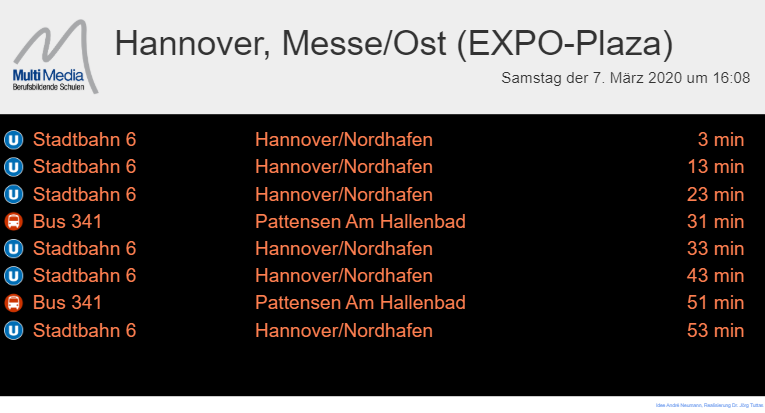

# GVH Abfahrtzeiten


Die Anwendung zeigt die nächsten Abfahrtzeiten von der gewählte Haltestelle (station) an. Default ist die Haltestelle Hannover / Messe-Ost. Liegen keiner Echtzeitinformationen vor, so wird die Zeitanzeige in kursiv dargestellt.
## Installation (Server)
Nach dem Clonen des Repositories müssen zunächst die Abhängigkeiten installiert werden, via
```
npm install
```
Dann müssen die Typescript Dateien mit Hilfe des Typescript-Compilers *tsc* übersetzte werden. Dieses geschieht einfach über den Befehl:
```
tsc
```
Anschließend kann der Server gestartet werden über..
```
npm start
```
Nun kann über einen Browser die Seite **http://localhost:8999** aufgerufen werden!

Alternativ kann ser Server auch wie folgt gestartet werden:
```
node Server.js [station] [Port]
```
- station: Stationsnummer 
- port: Portnummer 
## Installation Client (Webseite)
Da Browser keiner Module laden können, muss das Tool *bowserify* verwendet werden. Dieses ist zunächst ggf. zu installieren über:
```
npm install -g browserify

```
Anschließend kann das Tool verwendet werden, um die übersetzen TS Datei in einer Datei zu packen. Dieses geschieht wie folgt.
```
browserify client/main.js -o public/bundle.js

```
Der Client kann über zwei Parameter gesteuert werden. 
- **rows**: Gibt die Anzahl der Zeilen aus, die angezeigt werden.
- **filter**: Filtert die Ergebnisliste mit Hilfe eines Regulären Ausdrucks.

So zeigt der Aufruf *http://{Server-IP}?rows=4&filter=Bus* die nächsten 4 Busverbindungen der Haltestelle an.

## Docker Container
Es existiert auch ein Dockercontainer. Dieser kann wie folgt gestartet werden:
```
docker run -p 8999:8999 service.joerg-tuttas.de:5555/root/gvhanzeige

```
Als Umgebungsvariable kann STATION auf einen anderen Wert gesetzt werden.
```
docker run -p 8999:8999 -e STATION=25001795  service.joerg-tuttas.de:5555/root/gvhanzeige
```

